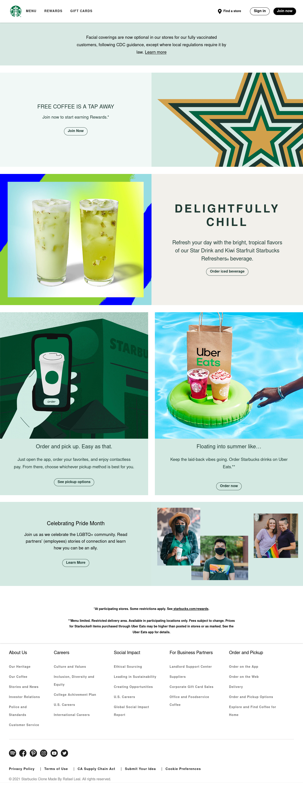

# Starbucks Clone

This is a clone of [Starbucks website](https://www.starbucks.com/). 
## Table of contents

- [Overview](#overview)
  - [The challenge](#the-challenge)
  - [Screenshot](#screenshot)
  - [Links](#links)
- [My process](#my-process)
  - [Built with](#built-with)
  - [What I learned](#what-i-learned)
- [Author](#author)

## Overview

### The challenge

-My first time cloning a website.

### Screenshot

### Links

- Solution URL: [Github repository](https://github.com/RafaelGLeal/Starbucks-clone)
- Live Site URL: [Live Site](https://rafaelgleal.github.io/Starbucks-clone/)

### Built with

- Semantic HTML5 markup
- CSS custom properties
- Flexbox

### What I learned

Using what i've learned about html and css, and put em at practice. 

## Author

- Website - [Rafael G. Leal](https://github.com/RafaelGLeal)
